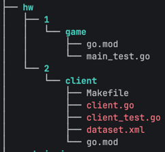

# grader
Сервис Web Client
 * html templates для пользователей + админка
 * rate limiter на загрузку файлов 
 * swagger для документации хэндлеров
 * JWT токен в куке
 * CSRF protection
 * обработка по категориям ошибок + логирование
 * загрузка файла main.go для запуска review - хранение файла в s3 minio
 * валидация загружаемых файлов
 * паттерн transactional outbox, создание события в таблице outbox с дальнейшей передачей в очередь rabbit
 * обработка callback вызова от сервиса grader, авторизация через header Authorization - отдельный JWT
 * метрики prometheus

Сервис Queue Processor
* переиспользован с прошлой задачи, достаточно было поменять конфиг, переключить на rabbit с указанием названия target очереди и url для внешнего вызова

Сервис Grader
* handler для обработки запроса от queue processor, payload в теле запроса
* загрузка файла из s3 minio, локальное хранение с дальнейшей прокидкой в docker container
* удаление файла после запуска docker
* worker pool для запуска docker и запуска тестов
* callback вызов
* метрики prometheus

Docker image 
* сборка с копией проекта

* при запуске прокидывается в нужную директорию по номеру HW загруженный файл из review и запускается тест